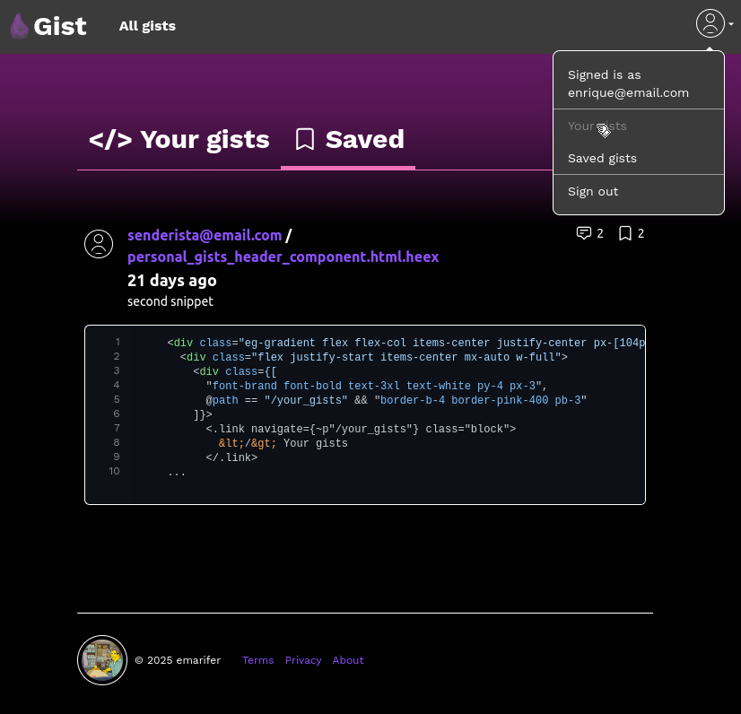

<div align="center">

# ElixirGist


### A GitHub Gist clone built with the [`Elixir`](https://elixir-lang.org/) language's [`Phoenix`](https://www.phoenixframework.org/) framework to learn and test its capabilities.


<br /><br />
  
   

</div>

<hr />

### Features 🚀

- [x] **General features:** : This is a [`GitHub Gist`](https://gist.github.com/discover) clone with reduced features, i.e., a **minimum viable product** (MVP). From there, any dev could plan and implement new features that would expand their capabilities. In any case, with `Elixir Gist` we can create a user account (the entire authentication system is automatically implemented by Phoenix upon project creation, thanks to the fantastic set of tools provided by both `Elixir` and the `Phoenix framework` itself, generally requiring only a few modifications to adapt it to our use case), and account confirmation via email; the authentication system will ensure the protection of views that require a logged-in user. Once inside the application, we can create code snippets whose syntax will be highlighted by the [`highlight.js`](https://highlightjs.org/) library (this library promises syntax highlighting for 192 languages ​​with 498 themes). These snippets can be copied/shared by any user, and their creator can edit/delete them. We can search all snippets stored in the database by name or description. This view displays pagination, sorting Gists in descending order by update date and time, and displays a summary preview of the snippet. We'll also have a view that shows only the snippets the current user has created or those they've saved as favorites. Finally, in the view that shows the full snippet, in addition to allowing the user who created it to edit/delete it, we can also save it as a favorite (or remove it from that list) and add comments, which are saved using `Markdown` syntax (using another JavaScript library, [`markdown-it`](https://github.com/markdown-it/markdown-it)), making the result more elegant than just plain text.

<div align="center">

###### Login & Forgot your password?:

&nbsp;&nbsp;

<br />

###### Gist creation page & Gist page with syntax highlighting and Markdown-style comments section:

&nbsp;&nbsp;

<br />

###### All Gists page showing pagination & Personal/Saved Gists page:

&nbsp;&nbsp;

<br />

</div>

- [x] **Using Phoenix framework + Phoenix LiveView:** The union of `Phoenix` with its subsidiary library [`LiveView`](https://hexdocs.pm/phoenix_live_view) creates, in the opinion of many, the best web framework on the market. LiveView enables rich, real-time user experiences with server-rendered HTML, offering a unified experience for building web applications. There's no longer a need to split work between the client and server, or across different tools, layers, and abstractions (see [here](https://github.com/phoenixframework/phoenix_live_view?tab=readme-ov-file#phoenix-liveview) for a more detailed explanation of its capabilities and features). The magic behind this technology, which enables server-side rendering (improving `SEO`) without the need for page reloads (and a better UX), lies in the use of `websockets`. In some cases, it's true that you'll need to code some `JavaScript` (well, it's not that bad… many of us come from there 😜) so you don't have to "bother" the server with a simple change you want to display in your interface. In any case, the `full-stack` developer experience will always be very rewarding.
- [x] **Using Elixir and Phoenix framework**: Well, what can we say about `Elixir`… the documentation and other sources state that "Elixir is a general-purpose, concurrent, functional programming language that runs on the `Erlang Virtual Machine` (`BEAM`), process-oriented and compiles to `bytecode` for that VM, known for building distributed, low-latency, fault-tolerant systems. Elixir is written on top of Erlang and shares the same abstractions for developing distributed. Elixir also provides extensible design with productivity tools. Among them, it is worth highlighting `IEx`, the fantastic interactive shell of Elixir, a `REPL` that allows us, among other things, to test code snippets, and `Mix`, a build tool that ships with Elixir that provides tasks for creating, compiling, testing your application, managing its dependencies and much more. Elixir includes support for compile-time `metaprogramming` with `macros` and `polymorphism` over `protocols`. These capabilities and Elixir's tools enable developers to be productive in diverse fields, including web development, embedded software, machine learning, data pipelines, and multimedia processing, across a wide range of industries". In short, for an average developer, Elixir is a comfortable, productive, robust and elegant language. On the other hand, Phoenix uses a server-side `model–view–controller` (`MVC`) pattern. Based on the [`Plug`](https://hexdocs.pm/plug/readme.html) library, and ultimately the HTTP server [`Bandit`](https://hexdocs.pm/bandit/Bandit.html) it was developed to provide highly performant and scalable web applications. In addition to the request/response functionality provided by the underlying Bandit server, Phoenix provides soft realtime communication to external clients through WebSockets or long polling using its language agnostic channels feature. Phoenix comes with [`Ecto`](https://hexdocs.pm/ecto/getting-started.html), the database container and query builder for Elixir that provides a standardized API (something like an `ORM`) and set of abstractions for communicating with all types of databases (`SQL`), particularly well suited for `PostgreSQL`. Two other notable features of Phoenix are LiveView and `HEEx`. LiveView (which we already talked about) provides real-time user experiences with server-rendered HTML over HTTP and WebSocket. `HEEx` (that extends [`EEx`](https://hexdocs.pm/eex/EEx.html) and allows you to embed Elixir code inside a string in a robust way) is Phoenix's templating language which provides HTML-aware compile time checking. On the frontend side, Phoenix offers us perfect integration with 2 tools: **Esbuild** and **Tailwindcss**. [`Esbuild`](https://esbuild.github.io/)(written in Go, to gain greater speed) to prepare assets via the [Elixir esbuild wrapper](https://github.com/phoenixframework/esbuild), and [`Tailwindcss`](https://tailwindcss.com/)(who writes raw CSS in 2025?) via the [Elixir tailwindcss wrapper](https://github.com/phoenixframework/tailwind) for CSS. The direct integration with esbuild and tailwind means that newly generated applications do not have dependencies on `Node.js` or an external build system (e.g. `Webpack`). Finally, you can read this interesting [post](https://www.phoenixframework.org/blog/the-road-to-2-million-websocket-connections) about Phoenix's extraordinary ability to handle concurrent connections (one of the reasons why it's one of the best web frameworks on the market).
- [x] **Further reading on Elixir/Erlang-OTP & Phoenix**: The extraordinary capabilities of the Erlang virtual machine (BEAM) and the languages ​​built on top of it (Elixir, Erlang, Gleam, and others) for managing concurrency and parallelism, which can far outperform other programming languages ​​considered faster than Elixir or Erlang (Rust, Go, for example), can be difficult for beginners to understand. With these other programming languages, you will be responsible for managing shared memory and, therefore, avoiding data races, data consistency, and bottlenecks, to name a few examples of the problems that can arise. However, BEAM (which actually behaves almost like an operating system) provides us right out of the box with great scalability, both vertically and horizontally, and powerful tools to analyze potential bottlenecks, which in the end usually results in better performance, particularly in the field of Web development than the aforementioned languages ​​with which it will always be easier to do it wrong than right. These phrases summarize the above quite well: "And sure, you can build reliable software in C - look at Erlang (the VM is written in C) the point is why would you want to? In the olden days, companies wrote their own 'operating systems', you could write your own operating system now, but why would you want to? There are millions of lines of robust tested code that 'does it', just like there are 1.5 million lines of robust tested code in the Erlang/OTP system that 'does it'. Using Erlang is about using the things that other people have written and only building the bits that make your company effective". In addition to the aforementioned documentation, here is a very brief list of information on the subject:
  * [How we program multicores - Joe Armstrong](https://www.youtube.com/watch?v=bo5WL5IQAd0), great talk by one of the creators of Erlang on parallelism
  * [Making reliable distributed systems in the presence of software errors - Joe Armstrong](https://erlang.org/download/armstrong_thesis_2003.pdf), Joe Armstrong's doctoral thesis on fault-tolerant and concurrent software
  * [What is the difference between multicore programming in Erlang and other language?](https://stackoverflow.com/questions/641326/what-is-the-difference-between-multicore-programming-in-erlang-and-other-languag/641873#641873), enlightening opinions on concurrent programming

---

### 👨‍🚀 Getting Started:

#### <ins>1. To test/modify the application (development mode):</ins>

Whether you're testing or modifying your application's code, you'll obviously need Elixir and Phoenix installed (in that order). Installing Elixir installs the entire ecosystem of language tools (e.g., `Mix`, `IEx` and `ExUnit`), `Erlang`, and the `Erlang virtual machine` (`BEAM`). To do this, carefully read the [instructions](https://elixir-lang.org/install.html) for your operating system.

If you are interested in programming with `Elixir&Erlang/OTP` and want to debugging complex systems, jumping at the code is not enough. It is necessary to have an understanding of the whole virtual machine, processes, applications, as well as set up tracing mechanisms. Luckily this can be achieved in Erlang with [`Observer`](https://hexdocs.pm/elixir/1.18.3/debugging.html#observer) (`:observer`). In your application:

```
$ iex
iex> :observer.start()
```

The problem is that this call may fail due to missing dependencies in your OS because you've installed a minimized version of Erlang (particularly common in some `Linux` distributions). The missing dependencies are specifically the `Erlang/OTP bindings to wxWidgets`. So, to avoid this problem, make sure to install `erlang-wx` (or `erlang-nox`, as appropriate) **<ins>before</ins>** installing Erlang.

To [install](https://hexdocs.pm/phoenix/installation.html) the Phoenix framework, once you have Elixir with its Mix tool, you will simply need one command:

```
$ mix archive.install hex phx_new
```

This is equivalent to installing an Elixir dependency of a project but globally on the system. From this moment on, with the Mix tool we can access the Phoenix project generator with the command:

```
$ mix phx.new hello
```

Now we will need a relational database server. Phoenix recommends using `PostgreSQL` and configures it by default, but we can switch to `MySQL`, `MSSQL`, or `SQLite3` by passing the `--database` flag when creating a new application. Since we're using PostgreSQL in this application, we'll need to have it started on our system. If you don't want to install it directly, you can start it from a `Docker` container (obviously, you'll also need to have Docker installed on your system). At the root of the project, you have a `docker-compose.yml` file to create the container by simply running the following:

```
$ docker compose up -d

# docker container stop bs_db_local, to stop it
# docker container start bs_db_local, to start it again
```

If you don't have the PostgreSQL image, it will download it, create the container, and start it in the background. Additionally, a Docker volume will be created in a folder above the project folder, where all the data from our DB will be stored. You can interact directly with the database using any management/visualization application you have installed on your system for this purpose. If not, you can always manage the database running in the container using commands:

```
$ docker exec -it bs_db_local psql -U backend_stuff

# (pass: blork_erlang)
# \c elixir_gist_dev, to connect to the `elixir_gist_dev` database running on the container.
```

>[!NOTE]
>***Aside from the SQL language you'll need to manage/verify what the application creates, you can review more commands [here](https://hasura.io/blog/top-psql-commands-and-flags-you-need-to-know-postgresql).***

Finally, since the application uses JavaScript libraries for syntax highlighting and markdown rendering on the front-end, when you start the project setup, an error will occur if `Node.js` is not installed on the system, as the `npm` command will be run to perform the installation. This will also allow us to install other JavaScript libraries if we need them in the future.


>[!NOTE]
>***Phoenix provides a very handy feature called Live Reloading. As you change your views or your assets, it automatically reloads the page in the browser. In order for this functionality to work, you need a filesystem watcher. macOS and Windows users already have a filesystem watcher, but Linux users must install inotify-tools. Please consult the inotify-tools wiki for distribution-specific installation instructions.***


Now we are ready to begin…

#### <ins>2. To start your Phoenix server and application:</ins>

  * Run `mix setup` to install and configure dependencies, perform database migrations, and bundle assets (`.js`, `.css` files, and images)
  * Start Phoenix endpoint with `mix phx.server` or inside IEx with `iex -S mix phx.server`

Now you can visit [`localhost:4000`](http://localhost:4000) from your browser.

Ready to run in production? Please [check our deployment guides](https://hexdocs.pm/phoenix/deployment.html).

### Learn more

  * Official website: https://www.phoenixframework.org/
  * Guides: https://hexdocs.pm/phoenix/overview.html & https://hexdocs.pm/elixir/introduction.html
  * Docs: https://hexdocs.pm/phoenix
  * Forum: https://elixirforum.com/c/phoenix-forum
  * Source: https://github.com/phoenixframework/phoenix

---

### Happy coding 😀!!
